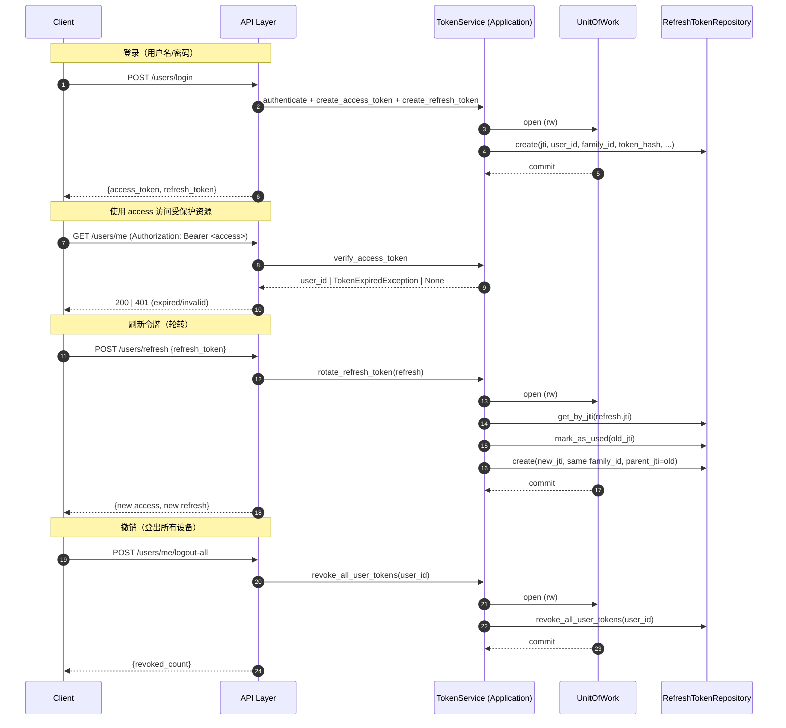

# 架构与代码设计（FastAPI Forge）

本文面向初入职同学，系统讲解本项目的整体设计理念、关键代码结构、层间依赖、运行时流程，以及如何在不破坏边界的情况下扩展功能。读完后你应能：
- 说清楚 DDD 分层在本项目的落地做法与依赖方向
- 了解应用启动、日志、异常、认证、存储、支付等关键横切能力
- 快速定位代码与按套路扩展一个用例（含持久化/外部适配）

---

## 总览
- 架构风格：DDD + Hexagonal（端口/适配器）+ Clean Architecture 的组合实践
- 依赖方向：API → Application → Domain；Infrastructure 仅通过接口暴露给 Application 使用，Domain 不依赖 Infrastructure
- 技术栈：FastAPI、SQLAlchemy(Async)、Alembic、Redis、structlog、Pydantic v2、Celery（任务）、对象存储（本地/S3/OSS）、支付网关（Stripe/Alipay/WeChat）

关键入口：`main.py:89` 创建 `FastAPI` 应用，注册中间件、异常处理、路由，生命周期中初始化数据库、Redis、存储客户端。

---

## 目录结构（按职责）
- API（路由/中间件）：`api/`
- 应用层（用例编排/DTO/端口）：`application/`
- 领域层（实体/服务/仓储接口/事件）：`domain/`
- 基础设施（ORM 模型/仓储实现/外部客户端/UoW/任务）：`infrastructure/`
- 核心（配置/日志/异常/统一响应）：`core/`
- 共享（业务码等常量）：`shared/`
- 迁移：`alembic/`
- 入口：`main.py`

建议先读：`core/` → `main.py` → `api/` → `application/` → `domain/` → `infrastructure/`。

---

## 启动与生命周期
- 入口：`main.py:34` 定义 `lifespan`
  - 开发环境自动建表：`infrastructure/database.py:47 create_tables()`；生产通过 Alembic 迁移
  - 初始化 Redis：`infrastructure/external/cache/redis_client.py`（见 `init_redis_client` 导出）
  - 初始化存储：`infrastructure/external/storage/__init__.py`，按配置创建 provider 并健康检查
- 中间件注册顺序（下到上）：
  - `api/middleware/request_id.py:22 RequestIDMiddleware` 生成/透传 `X-Request-ID`，并写入 `contextvars`
  - `api/middleware/logging.py` 结构化请求/响应日志（可开关、脱敏、限流体积）
  - `fastapi.middleware.cors.CORSMiddleware`
- 异常注册：`core/exceptions.py:55 register_exception_handlers`
  - 将领域 `BusinessException` 映射到 HTTP 状态；参数校验与全局异常统一为 `Response` 格式

---

## 配置与环境
- 全局配置：`core/config.py`（Pydantic Settings v2；支持嵌套环境变量 `__`）
  - 强制 `SECRET_KEY`：`core/config.py:158` 未设置将直接抛错，确保 JWT 安全
  - 重要段：`database`、`redis`、`storage`、`kafka`、分页、请求体日志开关
- 支付配置：`core/settings.py` 独立 `PaymentSettings`，覆盖默认 provider、重试/超时、webhook 容忍窗口及各渠道密钥
- 环境变量样例：`env.example`

---

## 日志与追踪
- 结构化日志：`core/logging_config.py` 使用 structlog
  - 开发渲染 Console、生产渲染 JSON
  - 通过 `contextvars` 绑定 `request_id`、`method`、`path` 等，贯穿 stdlib 与 structlog
- 请求日志：`api/middleware/logging.py`
  - DEBUG + 配置项默认开启；请求头 `X-Log-Body: true|false` 可临时覆盖
  - 敏感字段自动脱敏：`password`、`token`、`access_token` 等
  - 仅截取前 N 字节（默认 2048），避免大包阻塞

---

## 统一响应与错误模型
- 响应模型：`core/response.py:34 Response[T]`、`PaginatedData[T]`
  - UTC-Z 时间序列化、统一 `code/message/data/error` 结构
- 业务码：`shared/codes.py BusinessCode`
- 异常映射：`core/exceptions.py` 将领域/HTTP/校验异常统一为标准响应，携带 `request_id` 便于排查

---

## DDD 分层与依赖方向
- API：仅做 I/O 绑定与依赖注入；不写业务 & 不触达 ORM/外部 SDK
- Application：
  - 编排领域服务与事务边界（UoW），进行 DTO ↔ 实体转换
  - 通过端口（Ports）使用基础设施（如对象存储/支付网关）
- Domain：
  - 纯业务：实体（Entity）封装规则、领域服务（Service）处理跨实体逻辑、仓储接口（Repository）描述持久化契约、领域事件（Event）记录重要业务事实
- Infrastructure：
  - ORM 模型与仓储实现、UoW、外部系统客户端（存储/支付/消息/缓存）与适配器（Adapters）

保持“内层不依赖外层”的单向依赖是项目的第一原则。

---

## 跨层职责（认证与令牌）

认证/令牌能力以“应用层编排 + 基础设施持久化”的方式落地：

- Access Token（访问令牌）
  - 应用层 `TokenService` 负责生成与校验（JWT，无状态，不落库）；
  - 被 API / WebSocket / gRPC 三处依赖注入用于鉴权；
  - 过期时间较短，提升撤销近似效果（如需强撤销，可扩展服务端 denylist）。
- Refresh Token（刷新令牌）
  - 需要持久化（仅存哈希），支撑轮转、防重用与撤销；
  - ORM 模型在基础设施层（`infrastructure/models/refresh_token.py`），仓储实现（`.../repositories/refresh_token_repository.py`）；
  - 应用层 `TokenService.rotate_refresh_token()` 统一实现家族链追踪（`family_id`）、标记已用、重用检测与整家族撤销。

依赖方向：API/WS/gRPC → TokenService（Application） → UoW/仓储（Infrastructure，仅在刷新场景）。领域层保持纯业务，不绑定具体存储/JWT 实现。

---

## 时序图（登录/刷新/轮转/撤销）

---

## API 层（表现层）
- 认证依赖：`api/dependencies.py`
  - 支持 OAuth2 密码模式（Swagger UI）与 Bearer（直调），统一提取 Token → 应用层校验
  - 用户态依赖：`get_current_user`、`get_current_active_user`、`get_current_superuser`
- 路由：
  - 用户：`api/routes/user.py`（注册/登录/刷新/我/更新/改密/列表/激活/停用/删除）
  - 文件存储：`api/routes/storage.py`（直传预签名/直传完成/中转上传）
  - 文件管理：`api/routes/files.py`（分页、详情、预览/下载签名、删除）
  - 支付网关：`api/routes/payments.py`（webhook、发起、查询、退款、关闭）
- 设计要点：
  - 控制器保持“瘦”，仅做 DTO 组装与调用 `Application Service`
  - 安全策略：普通用户仅可访问/操作自己的文件；签名 URL 仅在响应时动态生成，不入库

---

## 应用层（用例编排）
- 用户用例：`application/services/user_service.py`
  - 注册首超：在可能为首用户时，借助 Redis 分布式锁二次确认，避免并发竞态
  - 登录/刷新：`PyJWT` 生成/校验 `access/refresh`；`verify_token` 区分“过期”（抛出）与“无效”（返回 None）
  - 事务：通过 `SQLAlchemyUnitOfWork` 控制提交/回滚，读操作使用 `readonly=True`
- 文件用例：`application/services/file_asset_service.py`
  - 直传：生成对象存储预签名 + 先创建 pending 资产，完成后回填元数据并激活
  - 中转上传：API 接收字节 → 上传存储 → upsert 活跃资产（仅存稳定公共 URL，不存 presigned URL）
  - 端口：通过 `application/ports/storage.py` 抽象存储能力，避免耦合具体 SDK
- 支付用例：`application/services/payment_service.py`
  - 统一 `PaymentGateway` 协议；为创建/退款生成稳定幂等键（订单维度），降低网络重试副作用
  - Webhook 仅解析与去重（Redis body hash + event.id），领域事件留给业务集成扩展

---

## 领域层（业务核心）
- 用户实体：`domain/user/entity.py` 封装邮箱/用户名/手机号/状态变更/改密等规则
- 用户领域服务：`domain/user/service.py` 处理注册、认证、改密、激活/停用并产生领域事件
- 文件实体：`domain/file_asset/entity.py` 聚合根，维护文件状态机（pending/active/deleted）与对象元数据
- 契约接口：`domain/user/repository.py`、`domain/file_asset/repository.py`、`domain/common/unit_of_work.py`
- 领域异常与业务码：`domain/common/exceptions.py` 与 `shared/codes.py`

领域层不导入任何基础设施模块。

---

## 基础设施层（实现细节）
- ORM 模型：`infrastructure/models/user.py`、`infrastructure/models/file_asset.py`
- 仓储实现：`infrastructure/repositories/user_repository.py`、`infrastructure/repositories/file_asset_repository.py`
- UoW：`infrastructure/unit_of_work.py` 统一开启/提交/回滚事务，并在只读模式跳过提交
- 数据库：`infrastructure/database.py` 规范化异步 URL、引擎/会话工厂、建表/删表
- 缓存：`infrastructure/external/cache/redis_client.py` 功能完备（命名空间、序列化、指标、锁/流水线）
- 存储：
  - 配置/工厂：`infrastructure/external/storage/config.py`、`.../factory.py`
  - Provider：`.../providers/local.py`（本地）、`.../providers/s3.py`、`.../providers/oss.py`
  - 适配到应用端口：`infrastructure/adapters/storage_port.py` 将 provider 模型翻译为 `StoragePort` DTO
- 支付：
  - 协议：`domain/services/payment_gateway.py`
  - 统一基类：`infrastructure/external/payments/base.py`
  - Provider：`stripe_client.py`、`alipay_client.py`、`wechatpay_client.py`（按 `core/settings.py` 配置）
  - 工厂：`infrastructure/external/payments/__init__.py get_payment_gateway()`
- 消息：`infrastructure/external/messaging/`（Kafka 抽象/工厂/中间件与重试拓扑，详见 `docs/messaging.md`）

---

## 数据库与迁移
- 元数据：`infrastructure/models/base.py` 导出 `metadata`，`alembic/env.py` 直接引用，支持 autogenerate
- 迁移：`alembic/versions/*.py`；本地开发也可用 `create_tables()` 快速起步，生产仅用 Alembic
- 注意：当前示例迁移包含 `file_assets` 表，`users` 表由 ORM 定义但可能需要你执行 `alembic revision --autogenerate` 生成初次迁移

---

## 安全与合规
- 配置强约束：`SECRET_KEY` 未设置即失败（任何环境），避免热重载导致 Token 失效
- 认证：OAuth2 Password（文档端）与 Bearer（生产端），统一校验/声明 `WWW-Authenticate`
- CORS：`core/config.py` 支持 JSON/逗号分隔两种格式
- 日志脱敏：见“日志与追踪”，严禁打印明文口令/密钥
- 存储直传：服务端仅生成预签名与记录元数据，不存敏感的临时签名

---

## 性能与可靠性
- 全异步 IO（FastAPI + Async SQLAlchemy + httpx）
- Redis 作为分布式锁与 webhook 去重缓存，时间窗口可配置
- 请求日志可按需关闭/限流，避免大包导致开销放大
- 支付/对象存储客户端内置重试与超时（见各基类/配置）

---

## 测试策略
- 单元测试优先覆盖边界与协议：
  - 支付服务幂等键：`tests/payments/test_service_idempotency.py`
  - 各 Provider webhook 解析：`tests/payments/test_*.py`
  - 路由注册冒烟：`tests/test_payments_skeleton.py`
- 建议补充：
  - 用户注册/登录/权限流的 API 级集成测试（`httpx.AsyncClient`）
  - 文件直传/中转上传的应用层测试（mock 存储端口）

---

## 常见扩展步骤（配方）
- 新用例（带持久化）
  1) 在 `domain/entities/...` 定义实体与规则；在 `domain/.../repository.py` 定义仓储接口
  2) 在 `infrastructure/models/...` 建表模型；`infrastructure/repositories/...` 实现仓储
  3) `alembic revision --autogenerate` 生成迁移并 `upgrade`
  4) 在 `application/..._service.py` 实现用例编排（UoW + DTO）
  5) 在 `api/routes/...` 暴露端点，只做 DTO 组装与依赖注入
- 新外部能力（如新增对象存储）
  1) 在 `infrastructure/external/storage/providers/` 实现 provider；在 `.../factory.py` 注册
  2) 若需应用层解耦，编写 `adapters/*_port.py` 适配为 `application.ports.*`
  3) 在 `main.py` 生命周期初始化，并通过依赖注入提供给应用层
- 新支付渠道
  1) 实现应用端口 `application.ports.payment_gateway.PaymentGateway`
  2) 参考现有 `*client.py` 实现 SDK 适配；在 `infrastructure/external/payments/__init__.py` 注册
  3) 在 `.env` 设置渠道配置与 webhook 密钥，按需扩展 `docs/payments.md`

---

## 关键代码参考（跳读索引）
- 入口与生命周期：`main.py:34`、`main.py:89`
- 配置：`core/config.py:98`、支付 `core/settings.py:39`
- 日志：`core/logging_config.py:22`；请求 ID：`api/middleware/request_id.py:22`
- 统一响应：`core/response.py:34`；异常映射：`core/exceptions.py:55`
- 应用服务：用户 `application/services/user_service.py:1`，文件 `application/services/file_asset_service.py:1`，支付 `application/services/payment_service.py:1`
- 领域：实体 `domain/user/entity.py:1`、`domain/file_asset/entity.py:1`；服务 `domain/user/service.py:1`
- UoW 与仓储实现：`infrastructure/unit_of_work.py:1`、`infrastructure/repositories/*.py`
- 存储工厂：`infrastructure/external/storage/factory.py:1`；本地 provider：`.../providers/local.py:1`
- 支付工厂与基类：`infrastructure/external/payments/__init__.py:1`、`.../base.py:1`

---

## 已知注意点（便于新人避坑）
- 存储初始化小问题：`infrastructure/external/storage/__init__.py` 中 `init_storage_client()` 使用了未定义的 `s` 变量来读取校验配置，应改为读取 `config` 或 `settings.storage`。当前路径在 DEBUG 下通常不影响功能，但建议修复后再依赖运行时校验中间件。
- Alembic 初始迁移仅包含 `file_assets` 表，如需在生产落库 `users`，请执行 `alembic revision --autogenerate` 生成并升级。
- 支付 SDK 非强依赖路径在 CI 中以 `pytest.importorskip`/monkeypatch 方式降级，真机联调请按 `docs/payments.md` 配置密钥。

---

## 新人上手建议（学习顺序）
1) 通读本文 + `README.md`，启动本地服务与 Swagger
2) 跟着“用户注册”用例从 API → Application → Domain → Repository 跑一遍代码
3) 读“文件直传”流程：预签名 → pending 记录 → 完成后激活
4) 读“支付 webhook”解析与 Redis 去重
5) 练手：新增一个简单实体 + 列表/创建接口，按“配方”完成端到端闭环

---

如需我继续：
- 增补“用户 API 集成测试”示例
- 给存储初始化的已知问题提 PR 修复
- 依据你们的业务域建一个模板用例（含迁移/仓储/路由）
