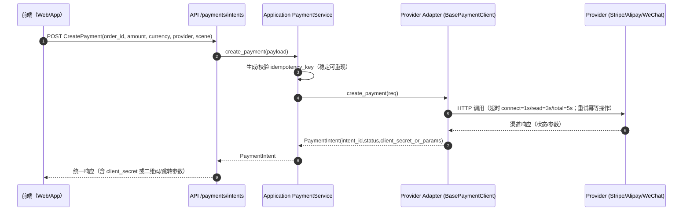
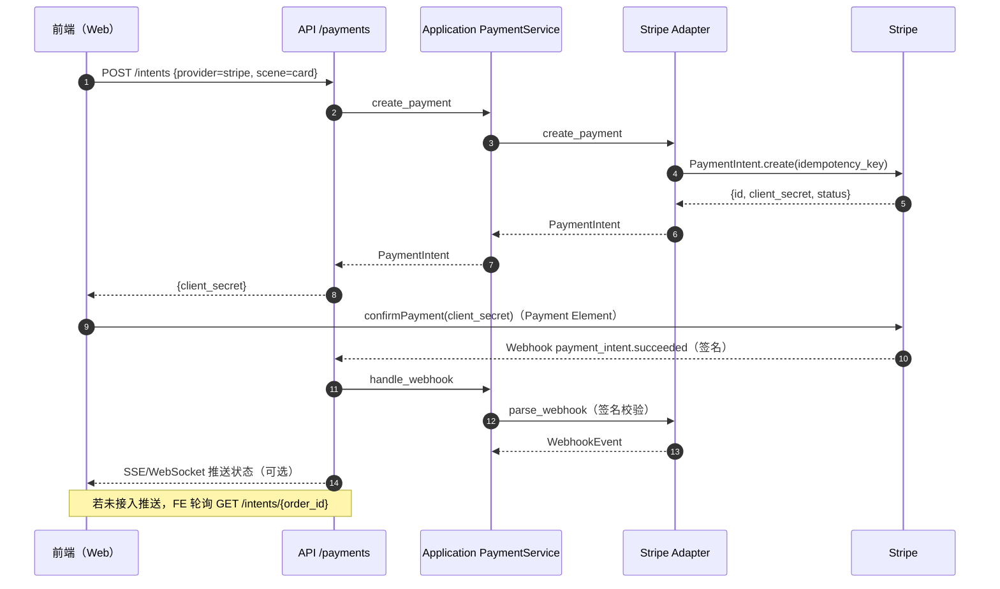
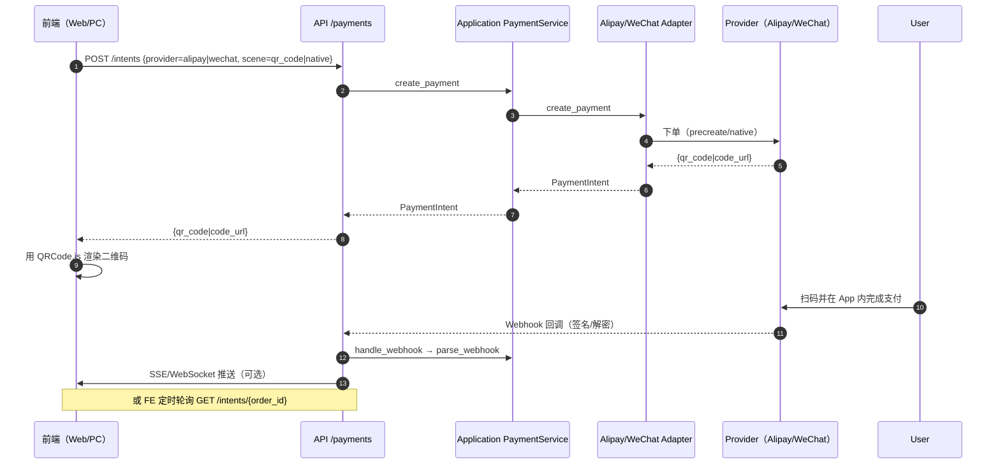
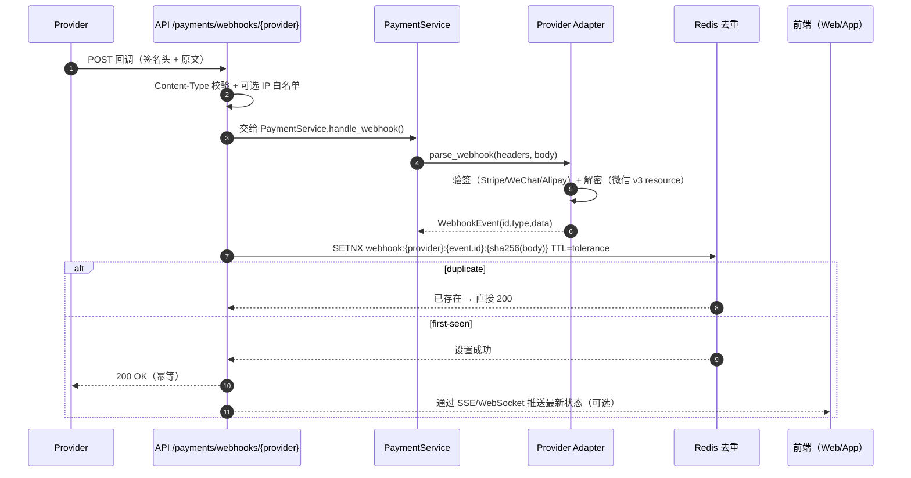
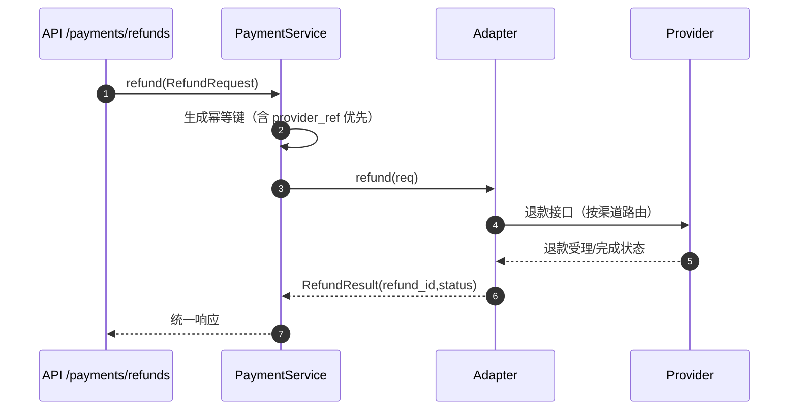

# 支付网关（Payments）

统一封装 Stripe / 微信支付 v3 / 支付宝 的可替换、可测试、可观测网关接口，遵循 DDD 分层：

- application：端口协议（PaymentGateway）与用例编排（PaymentService）
- domain：领域实体与状态机（不依赖具体 SDK）
- infrastructure：各 Provider 适配器、签名与证书、HTTP 客户端、Webhook 解析
- api：路由层，统一回调入口与去重、最小参数校验

目录位置：`infrastructure/external/payments/`

- `base.py` 统一适配基类（httpx 超时/重试、日志、状态映射、aclose 资源释放）
- `stripe_client.py`、`wechatpay_client.py`、`alipay_client.py` 各渠道实现
- `exceptions.py` 第三方错误 → 统一异常映射
- `schemas/`、`signature/`、`webhooks/` 预留扩展位

更多 API / DTO 见：
- `application/services/payment_service.py`
- `application/dtos/payments.py`
- `api/routes/payments.py`

---

## 1. 创建支付（Create Payment）时序图（含前端）



- Stripe：返回 `client_secret`，前端用 Stripe.js Payment Element 完成确认
- 支付宝/微信：返回 `qr_code/code_url` 或页面跳转参数

---

### 1.1 Stripe：Payment Element 端到端序列图（含回调与前端更新）



### 1.2 扫码支付（支付宝/微信）PC/H5 端到端序列图（含前端二维码）



> 示例页：`examples/payments/demo/index.html` 已内置 Payment Element 与二维码渲染（QRCode.js）。

---

## 2. 回调（Webhook）处理流程（含前端更新）



- 安全：
  - Stripe 用 `Stripe-Signature` + construct_event 容差校验
  - 微信 v3 用 SDK 头验签 + AES-256-GCM 解密 resource
  - 支付宝用 RSA2（去除 sign/sign_type 后字典序串联）
  - API 层可选 IP 白名单 `PAYMENT__WEBHOOK__IP_ALLOWLIST`
  - 回调幂等：event.id + body 哈希 去重，TTL=容差窗口

> 注：本仓库示例未包含“状态持久化/推进”，可在接收到事件后由 application 层提升为领域事件并更新内部交易表。

---

## 3. 退款（Refund）与关闭（Close）



- Stripe：优先使用 `provider_ref`（charge/intent id），否则以 `order_id` 的 metadata 反查
- 微信：支持 `transaction_id`（provider_ref）或 `out_trade_no`
- 支付宝：按 `out_trade_no`，金额字符串（元）

关闭流程类似：根据 `order_id` 查询未完成意图并调用 cancel/close。

---

## 4. 幂等、超时与重试

- 幂等键：稳定可重现，不含时间戳
  - create：`sha256("create|order_id|amount|currency|provider|scene|meta_subset")`
  - refund：`sha256("refund|order_id|provider_ref|amount|currency|provider")`
  - Stripe 透传 `idempotency_key` 到官方 SDK
- 超时：`connect=1s, read=3s, write=3s, total=5s`
- 重试：仅对幂等且可安全重试的网络/5xx/限流错误使用指数退避；对非幂等操作先查询再补偿

---

## 5. 状态机与状态映射

内部状态（domain/entities/payment.py）：

```
created → pending/processing → succeeded | failed | canceled
退款：refund_pending → refunded | refund_failed；支持 partial_refunded
异常：chargeback/dispute（按需扩展）
```

渠道→内部状态映射在 `shared/codes/payment_codes.py`：
- Stripe：`processing/requires_action/succeeded/canceled/...`
- 支付宝：`WAIT_BUYER_PAY/TRADE_SUCCESS/TRADE_CLOSED/EXPIRED/...`
- 微信：`NOTPAY/USERPAYING/PROCESSING/SUCCESS/CLOSED/EXPIRED/REFUND/...`

---

## 6. 资源与连接管理

- httpx.AsyncClient 由 `BasePaymentClient` 管理，提供 `aclose()`；
- `PaymentService.aclose()` 统一调用网关释放资源；
- API 与 Celery 任务在调用后显式 `await service.aclose()`，避免连接泄漏。

---

## 7. 任务编排与补偿（Celery）

- `infrastructure/tasks/payment_tasks.py` 使用 `asyncio.run(...)` 执行协程，避免共享事件循环的线程安全问题
- 典型补偿：在 5/15/30/60 分钟周期内查询未回调订单，推进至终态
- 可扩展对账任务：下载渠道账单 → 与内部账目对齐 → 生成差异报告

---

## 8. 安全与合规

- 严禁存储卡号/PAN；优先托管（Stripe Elements / 支付宝/微信扫码/跳转）
- 私钥仅在内存或 KMS/Secret Manager 中，开发环境可放置在 `infrastructure/external/payments/keys/`
- Webhook：强制 POST + 内容类型校验 + 签名校验 + 去重 + 可选 IP 白名单
- 生产禁止调试与宽泛 CORS；必须设置 `SECRET_KEY`

---

## 9. 可观测性

- 日志字段：order_id, provider, idempotency_key, status_before/after, latency_ms, retry_count, provider_code
- 关键事件：创建/回调/退款/对账 打结构化日志（structlog）；可接入 Prometheus 导出指标

---

## 10. 快速开始（Demo）

1) 配置 `.env`（见 `env.example`）并安装依赖：
```
pip install -r requirements.txt
uvicorn main:app --reload
```
2) 浏览器打开示例页：`examples/payments/demo/index.html`
- Stripe：输入 Publishable Key → Create Intent → Pay（使用 Payment Element）
- 支付宝/微信：Create QR 渲染二维码并扫码
3) Webhook：
- Stripe：`stripe listen --forward-to http://localhost:8000/api/v1/payments/webhooks/stripe`
- 微信/支付宝：将官方回调地址指向 `/api/v1/payments/webhooks/{provider}`

---

## 11. 如何新增一个 Provider

1) 在 `infrastructure/external/payments/` 新增 `xxx_client.py`，继承 `BasePaymentClient`，实现 `create_payment/query_payment/refund/close_payment/parse_webhook`
2) 扩展 `shared/codes/payment_codes.py` 的状态映射
3) 在 `infrastructure/external/payments/__init__.py` 的工厂 `get_payment_gateway()` 注册
4) 在 `env.example` 与 `core/settings.py` 增加配置项
5) 加入 webhook 样例与单元测试（验签、状态映射、幂等）

---

如需端到端落地（持久化交易表、Saga/Outbox、Prometheus 指标、对账任务等），可以基于现有协议与用例服务继续扩展。

---

## 12. 前端状态刷新（SSE 与轮询）示例

扫码支付通常由“回调驱动状态推进 + 前端主动刷新”实现。下面给出两种方式：

### 12.1 简单轮询（推荐快速接入）

前端每 2 秒查询一次统一查询接口 `/api/v1/payments/intents/{order_id}`，终态后停止。

```html
<script>
  const base = document.getElementById('baseUrl').value.replace(/\/$/, '');
  const orderId = 'ORDER_20250919_0001';
  const provider = 'wechat'; // 或 alipay

  const terminal = new Set(['succeeded','failed','canceled']);
  let timer = null;

  async function poll() {
    try {
      const res = await fetch(`${base}/api/v1/payments/intents/${orderId}?provider=${provider}`);
      const json = await res.json();
      if (json.code !== 0) return;
      const st = json.data.status;
      document.getElementById('status').textContent = `状态：${st}`;
      if (terminal.has(st)) { clearInterval(timer); }
    } catch {}
  }

  timer = setInterval(poll, 2000);
  poll();
</script>
```

### 12.2 Server-Sent Events（SSE）推送（可选）

如果希望服务端主动通知状态变化，可增加一个 SSE 流式接口，前端通过 `EventSource` 订阅。

前端：

```html
<script>
  const base = document.getElementById('baseUrl').value.replace(/\/$/, '');
  const orderId = 'ORDER_20250919_0001';
  const provider = 'wechat';
  const es = new EventSource(`${base}/api/v1/payments/stream/${orderId}?provider=${provider}`);
  es.onmessage = (evt) => {
    const payload = JSON.parse(evt.data);
    const st = payload.status;
    document.getElementById('status').textContent = `状态：${st}`;
    if (["succeeded","failed","canceled"].includes(st)) { es.close(); }
  };
  es.onerror = () => es.close();
</script>
```

后端（FastAPI）可新增一个极简 SSE 路由（演示用）：

```python
from fastapi import APIRouter, Query
from starlette.responses import StreamingResponse
import asyncio, json
from application.services.payment_service import PaymentService
from application.dtos.payments import QueryPayment

router = APIRouter(prefix="/payments")

@router.get("/stream/{order_id}")
async def stream_status(order_id: str, provider: str | None = Query(None)):
    async def gen():
        from infrastructure.external.payments import get_payment_gateway
        svc = PaymentService(gateway=get_payment_gateway(provider))
        try:
            terminal = {"succeeded","failed","canceled"}
            while True:
                intent = await svc.query_payment(QueryPayment(order_id=order_id, provider=provider))
                yield f"data: {json.dumps({'order_id': order_id, 'status': intent.status})}\n\n"
                if intent.status in terminal:
                    break
                await asyncio.sleep(2)
        finally:
            await svc.aclose()
    return StreamingResponse(gen(), media_type="text/event-stream")
```

说明：
- SSE 接口是可选增强，生产可用消息队列/事件总线来驱动推送；若不增加 SSE，使用轮询即可满足大多数扫码场景。
- 无论轮询还是 SSE，服务端真实状态以渠道 Webhook 为准，查询仅作补偿与兜底。
